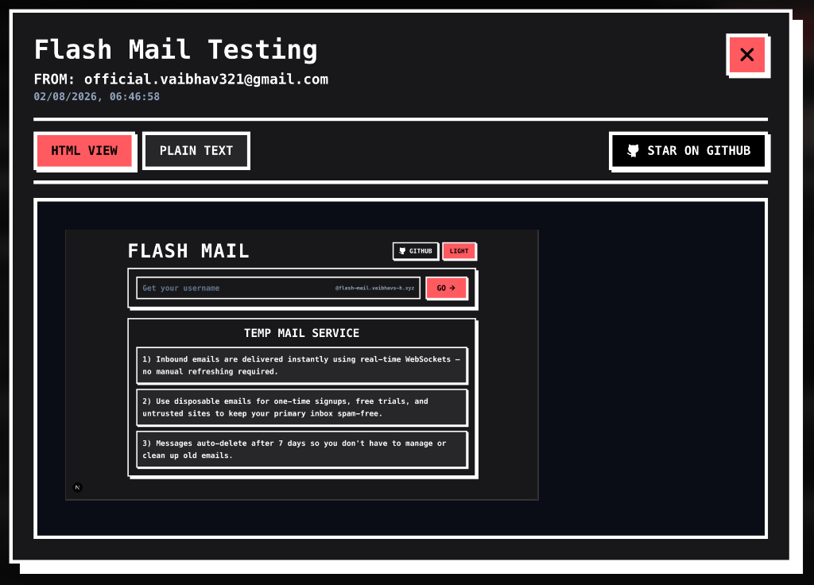

# FLASH-MAIL ✉️

A self-hosted Temporary Email Service. Create disposable email addresses instantly for your temporary needs.

[View Demo](https://flash-mail.vaibhavs-h.xyz) • [Report Bug](https://github.com/vaibhavs-h/Flash-Mail/issues) • [Request Feature](https://github.com/vaibhavs-h/Flash-Mail/issues)

 
 

## 🌟 Features

- **Instant Setup**: Create temporary email addresses in seconds
- **No Registration**: Zero signup required
- **Self-Hostable**: Run your own instance easily
- **Real-Time Live Sync**: Inbound emails arrive instantly without page refreshing
- **Neubrutalist Interface**: Clean, vibrant, and intuitive user experience

## 📧 SMTP Server Details

- **Server Address:** `flash-mail.vaibhavs-h.xyz`
- **Email Format:** `your-username@flash-mail.vaibhavs-h.xyz`
- All emails sent to `{username}@flash-mail.vaibhavs-h.xyz` will be automatically handled

## 🚀 Quick Start

1. Visit [flash-mail.vaibhavs-h.xyz](https://flash-mail.vaibhavs-h.xyz)
2. Choose your username
> ⚠️ **Security Note:** Your username is public. Do not use it for confidential communications.
3. Start using your temporary email: `{username}@flash-mail.vaibhavs-h.xyz`

## ⚠️ Limitations

- Attachments are not displayed in the hosted version.
- Email will be removed after 7 days from the database.

## 🤝 Contributing

Contributions are what make the open source community such an amazing place to learn, inspire, and create. Any contributions you make are **greatly appreciated**.

1. Fork the Project
2. Create your Feature Branch (`git checkout -b feature/feature_name`)
3. Commit your Changes (`git commit -m 'feature_name'`)
4. Push to the Branch (`git push origin feature/feature_name`)
5. Open a Pull Request

## 📜 License

Distributed under the MIT License. See `LICENSE` for more information.

## 🌟 Show your support

Give a ⭐️ if this project helped you!

## 📞 Contact

Project Link: [https://github.com/vaibhavs-h/Flash-Mail](https://github.com/vaibhavs-h/Flash-Mail)

---

Made with ❤️ for disposable email privacy

